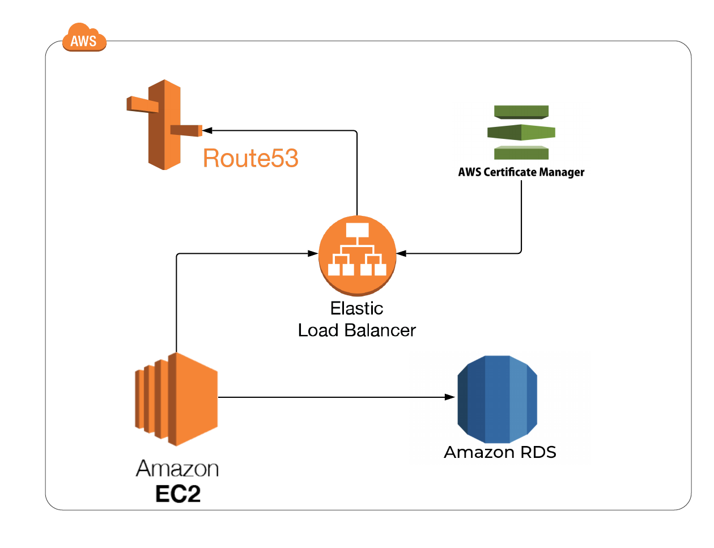
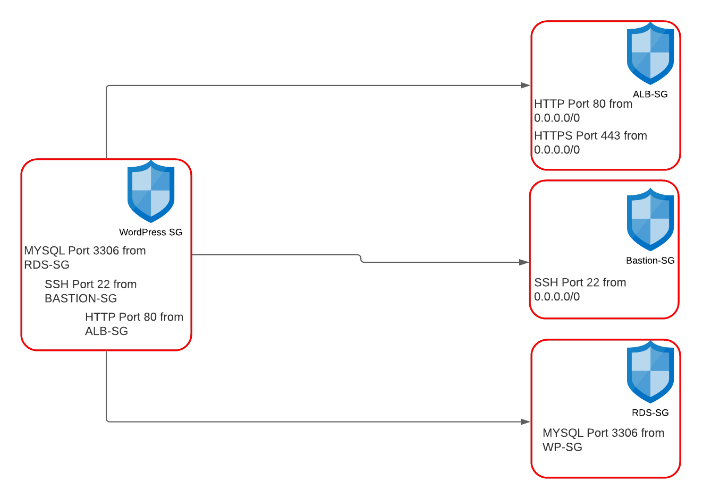
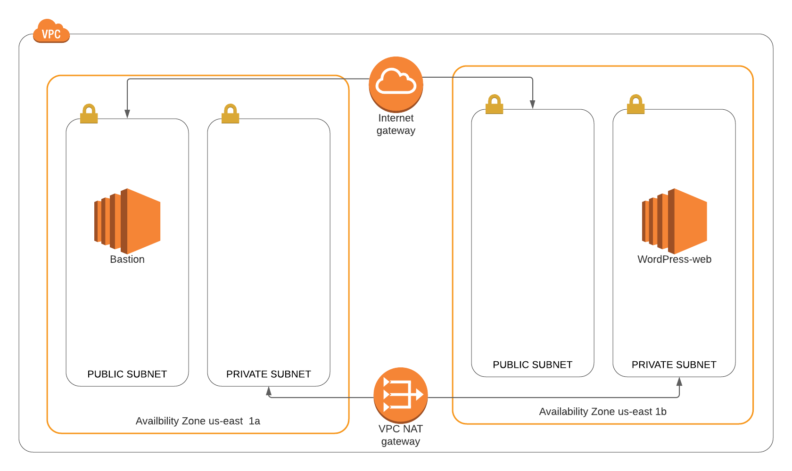

## WordPress on Cloudformation with Bastion host

 ## Prerequisites:
   - AWS account
   - AWS Cloudformation Documentation
   - VS code
   
## Description
 Creating a infrastracture on CDN with VPC and subnets, and placing wordpress host and database on private subnets. Only access to wordpress is with Bastion host beacouse it was created wit bastion-key, and that's why template is separated into two parts.
 
 
 
 
 
 
## Usage

## Resources

## Useful links
[AWS Cloudformation documetnation](https://docs.aws.amazon.com/cloudformation/)

[Lucid chart for diagram](https://lucid.app/users/login#/login)
